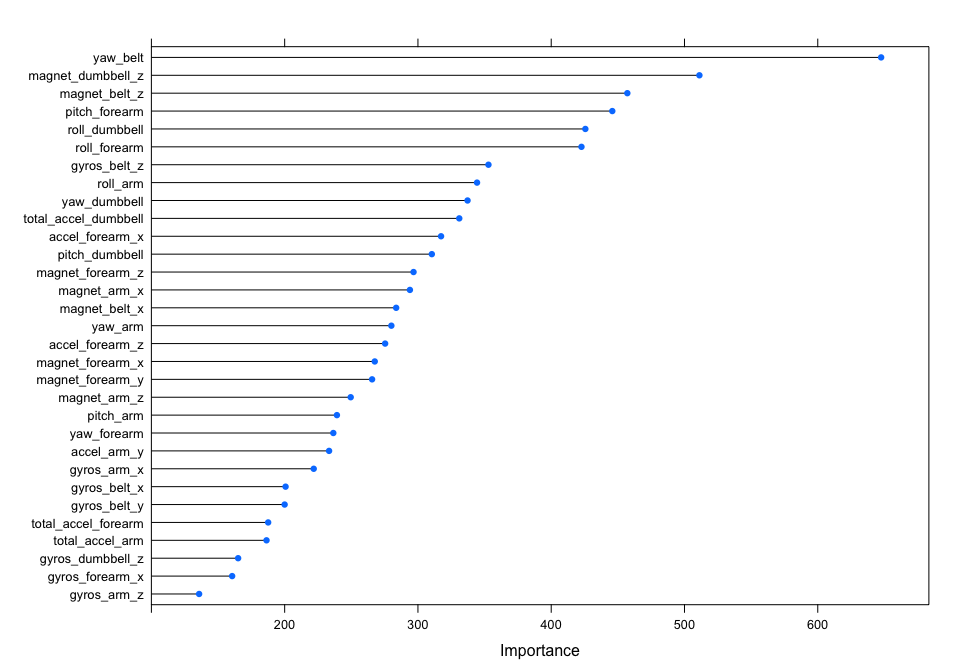

## Programming Assigment 1
## A Random Forest Model for Predicting the Correctness of Dumbbell Lift Exercises
### Author: Zdravka Cankova 
#### Data: Weight Lifting Exercises Dataset from HAR Website (http://groupware.les.inf.puc-rio.br/har) 
#### Source: Velloso, E.; Bulling, A.; Gellersen, H.; Ugulino, W.; Fuks, H. Qualitative Activity Recognition of Weight Lifting Exercises. Proceedings of 4th International Conference in Cooperation with SIGCHI (Augmented Human '13) . Stuttgart, Germany: ACM SIGCHI, 2013.  

---

#### Overview

The purpose of this project was to use the weightlifting exercises dataset from the HAR website to build a model predicting the correctness of performed exercises. A random forest model with 5-fold cross-validation was built, with a resulting accuracy of **0.9863** and out-of-sample error of **0.0113**. 

#### Data Analysis


First, I loaded the provided datasets into R (code not shown). Then, after examining the data in the pml-training set, I decided to convert the relevant features that were in factor format to numeric (excluding the first 7 variables, as well as the outcome variable).


```r
for(i in 8:159) {
      if(class(pml_training[,i]) == "factor") {
            pml_training[,i] <- as.numeric(as.character(pml_training[,i]))
      }
}
```

The pml-training dataset was split into training (60%) and testing (40%) sets.

```r
set.seed(1)
inTrain <- createDataPartition(y = pml_training$classe, p = 0.6, list = FALSE)
training <- pml_training[inTrain,]
testing <- pml_training[-inTrain,]
```

Then I proceeded to select the features in the new training set that would be included in the model using the following 3 criteria:  
1. Features that could not be reproduced, such as subject name, window and timestamp variables were excluded.   Although these might have an influence on the exercise correctness, they are irrelevant, because we want the model to be able to predict correctness regardless of who the subject is, or how long the exercise lasts.  
2. Features where more than half the data were missing were excluded (imputation is inefficient in this case and could introduce bias).  
3. Features highly correlated with others were excluded (correlation coefficient > 0.75).  

```r
trainingSubset <- subset(training[ , 8:160], 
                         select = which(colSums(is.na(training[ , 8:160])) < 0.5*length(training$classe)))

set.seed(1)
correlationMatrix <- cor(trainingSubset[,-53])
highlyCorrelated <- findCorrelation(correlationMatrix,
                                    cutoff = 0.75)
trainingFinal <- subset(trainingSubset,
                        select = -highlyCorrelated)
```

The resulting final training dataset was used to train a random forest model using 5-fold cross-validation repeated 3 times. A random forest model was chosen because it typically results in highest accuracy.


```r
#Create a list of seeds, changing the seed for each resampling
set.seed(1)
seeds <- vector(mode = "list", length = 16) #length is = (n_repeats*nresampling)+1
for(i in 1:15) {seeds[[i]] <- sample.int(n = 1000, 3)} #(3 is the number of tuning parameter, mtry for rf)

seeds[[16]]<-sample.int(1000, 1) #for the last model

fitControl <- trainControl(method = "repeatedcv",
                           number = 5,  ##5-fold CV
                           repeats = 3, ##repeated 3 times
                           seeds = seeds,
                           classProbs = TRUE,
                           verboseIter =TRUE,
                           allowParallel = TRUE)

cl <- makeCluster(detectCores())
registerDoParallel(cl)
set.seed(1)
RFFit<-train(classe ~ ., method = "rf", trControl=fitControl, data = trainingFinal)
```

```
## Aggregating results
## Selecting tuning parameters
## Fitting mtry = 2 on full training set
```

```r
stopCluster(cl)

print(RFFit)
```

```
## Random Forest 
## 
## 11776 samples
##    31 predictor
##     5 classes: 'A', 'B', 'C', 'D', 'E' 
## 
## No pre-processing
## Resampling: Cross-Validated (5 fold, repeated 3 times) 
## 
## Summary of sample sizes: 9421, 9420, 9423, 9420, 9420, 9421, ... 
## 
## Resampling results across tuning parameters:
## 
##   mtry  Accuracy   Kappa      Accuracy SD  Kappa SD   
##    2    0.9862998  0.9826669  0.003425196  0.004335810
##   16    0.9855636  0.9817374  0.002482734  0.003141822
##   31    0.9773829  0.9713916  0.003401933  0.004304803
## 
## Accuracy was used to select the optimal model using  the largest value.
## The final value used for the model was mtry = 2.
```

```r
RFFit$finalModel
```

```
## 
## Call:
##  randomForest(x = x, y = y, mtry = param$mtry) 
##                Type of random forest: classification
##                      Number of trees: 500
## No. of variables tried at each split: 2
## 
##         OOB estimate of  error rate: 1.13%
## Confusion matrix:
##      A    B    C    D    E class.error
## A 3341    5    1    1    0 0.002090800
## B   21 2247    9    2    0 0.014041246
## C    0   26 2018    9    1 0.017526777
## D    0    0   51 1878    1 0.026943005
## E    0    0    1    5 2159 0.002771363
```

The accuracy of the final model (first repeat with 2 variables at each split) was **0.9863**. A confusion matrix produced as a result of cross-validation is also shown. The resulting class errors are small. Based on this matrix, the overall *expected* out-of-sample error is **0.0113**.

The most important variables are the belt yaw, the dumbbell magnetometer reading in the z-direction, the belt magnetometer reading in the z-direction, the forearm pitch, and the dumbbell roll. The importance of variables is also summarized in the figure below:

```r
importance <- varImp(RFFit, scale=FALSE)
plot(importance)
```

 

Finally, the testing data set was used to calculate the true out-of-sample error. The resulting error was **0.0113** (1 - accuracy).

```r
testPredictions <- predict(RFFit, newdata = testing)
confusionMatrix(testPredictions, testing$classe)
```

```
## Confusion Matrix and Statistics
## 
##           Reference
## Prediction    A    B    C    D    E
##          A 2225   11    0    0    0
##          B    4 1494   15    0    0
##          C    2   10 1343   29    0
##          D    0    0   10 1257    4
##          E    1    3    0    0 1438
## 
## Overall Statistics
##                                           
##                Accuracy : 0.9887          
##                  95% CI : (0.9861, 0.9909)
##     No Information Rate : 0.2845          
##     P-Value [Acc > NIR] : < 2.2e-16       
##                                           
##                   Kappa : 0.9857          
##  Mcnemar's Test P-Value : NA              
## 
## Statistics by Class:
## 
##                      Class: A Class: B Class: C Class: D Class: E
## Sensitivity            0.9969   0.9842   0.9817   0.9774   0.9972
## Specificity            0.9980   0.9970   0.9937   0.9979   0.9994
## Pos Pred Value         0.9951   0.9874   0.9704   0.9890   0.9972
## Neg Pred Value         0.9988   0.9962   0.9961   0.9956   0.9994
## Prevalence             0.2845   0.1935   0.1744   0.1639   0.1838
## Detection Rate         0.2836   0.1904   0.1712   0.1602   0.1833
## Detection Prevalence   0.2850   0.1928   0.1764   0.1620   0.1838
## Balanced Accuracy      0.9975   0.9906   0.9877   0.9877   0.9983
```
